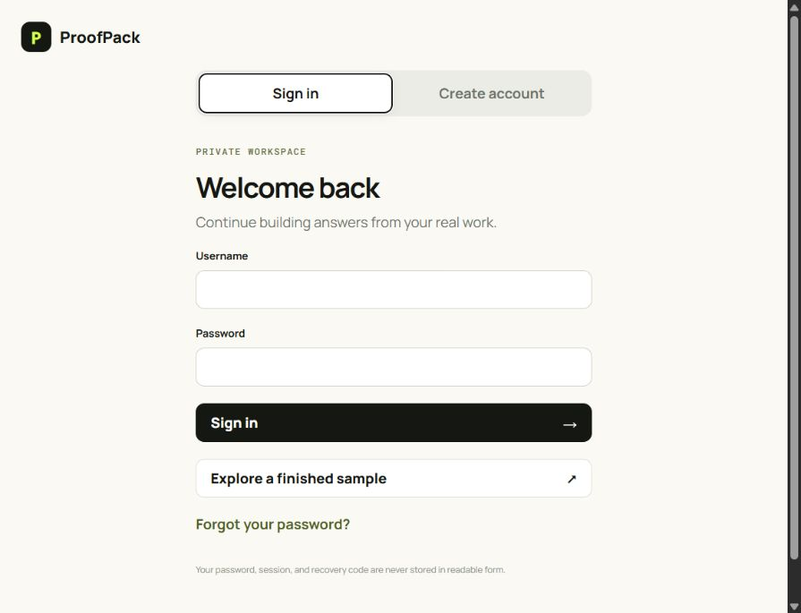
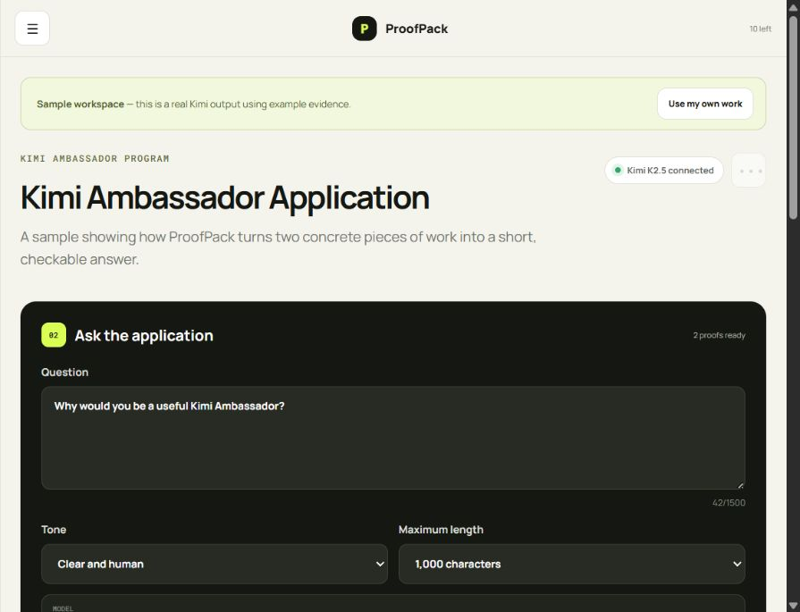
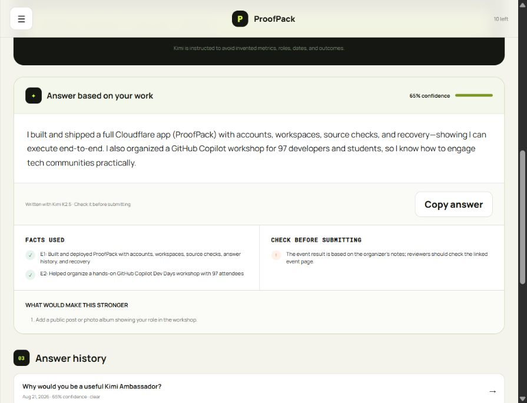

# ProofPack — Kimi Evidence Workspace

ProofPack turns scattered work into application answers that a user can defend. It is not a generic chat interface: Kimi K2.5 receives a structured evidence pack and must return the answer, facts used, unsupported-claim warnings, missing proof, and a confidence score.

**Live app:** [proofpack-kimi-arun.arunchandel1780.workers.dev](https://proofpack-kimi-arun.arunchandel1780.workers.dev)

**Public Kimi benchmark:** [proofpack-kimi-arun.arunchandel1780.workers.dev/benchmark.html](https://proofpack-kimi-arun.arunchandel1780.workers.dev/benchmark.html) — three inspectable cases covering relevant-fact retrieval, conflicting metrics, and prompt injection hidden inside evidence. The latest run passed 15/15 automatic checks; full outputs and limitations are recorded in [BENCHMARK.md](BENCHMARK.md).

**Kimi Workflow Lab:** [proofpack-kimi-arun.arunchandel1780.workers.dev/lab](https://proofpack-kimi-arun.arunchandel1780.workers.dev/lab) — a transparent two-pass workflow that maps messy context, builds a cited deliverable, validates every source ID in code, saves the run, and exposes the structured JSON, latency, model, and provider.

Read the implementation and threat-model notes in [WORKFLOW_LAB.md](WORKFLOW_LAB.md). The latest disposable end-to-end test is stored in [lab-results/latest.json](lab-results/latest.json).

The live release has been tested through the full disposable-user flow: registration, workspace creation, evidence storage, Kimi generation, character-limit enforcement, saved history, and account deletion.

## See the product in 30 seconds



*A reviewer can explore the finished sample without creating an account. Real evidence and generations remain inside private user workspaces.*



*Each application keeps its question, evidence, model choice, requested tone, and character limit together.*



*The useful output is not only the paragraph. ProofPack exposes the facts Kimi used, a claim to verify, and the next proof that would improve confidence.*

Read the short build story in [CASE_STUDY.md](CASE_STUDY.md), or use the timed [90-second walkthrough script](WALKTHROUGH_SCRIPT.md).

## Problem

Applicants, freelancers, founders, and community leaders repeatedly rebuild their story from memory. Their proof is spread across GitHub, event pages, Medium articles, deployed products, portfolios, and private notes. Generic writing tools create polished text but can invent or overstate details.

ProofPack gives each application a private evidence workspace. Users add their real work once, ask the exact application question, and receive a traceable Kimi answer.

## Complete user journey

1. Create an account and save a one-time recovery code.
2. Or open the read-only sample workspace to understand the complete result without registering.
3. Create a workspace for a program, role, grant, pitch, or biography.
4. Add projects, open-source work, articles, events, experience, metrics, and public proof links.
5. ProofPack enriches GitHub links through its public API and safely attempts other supported public pages; blocked pages remain attached as evidence.
6. Ask the exact application question and choose a tone.
7. Choose the application character limit and let Kimi generate an answer using the complete evidence pack.
8. Review the evidence used, honesty warnings, missing proof, and confidence score.
9. Copy the answer or reopen it from saved history.
10. Edit or delete evidence, applications, generations, or the entire account.

## Kimi integration

The Worker calls OpenRouter's OpenAI-compatible chat completion endpoint with `moonshotai/kimi-k2.5`. Source excerpts and user notes are explicitly treated as untrusted reference text. The model is instructed never to invent metrics, dates, users, roles, outcomes, technologies, or links, and the server enforces the selected character limit.

The expected JSON response is validated before storage:

```json
{
  "answer": "...",
  "facts_used": ["E1: ..."],
  "warnings": ["..."],
  "next_proof": ["..."],
  "confidence": 82
}
```

Kimi's API key is stored only as a Cloudflare Worker secret and is never exposed to the browser, D1, source code, or GitHub.

## Architecture

| Layer | Technology | Responsibility |
| --- | --- | --- |
| Edge API | Cloudflare Workers | Authentication, authorization, source reading, Kimi requests, quotas |
| Persistence | Cloudflare D1 | Accounts, sessions, applications, evidence, and generation history |
| Reasoning | Kimi K2.5 via OpenRouter | Long-context evidence analysis and constrained answer generation |
| Frontend | HTML, CSS, JavaScript | Responsive customer workflow without a framework runtime |
| Hosting | Cloudflare Workers Static Assets | Same-origin global delivery |

## Security and privacy

- PBKDF2-SHA-256 password hashing with unique salts and a server-only pepper.
- Hashed sessions and recovery codes.
- `HttpOnly`, `Secure`, `SameSite=Strict` cookies.
- Server-side ownership checks for every user record.
- Same-origin enforcement for state-changing requests.
- Registration, login, recovery, per-user generation, and whole-app spending limits.
- HTTPS-only evidence links and restricted automatic source readers to avoid arbitrary server requests.
- Prompt-injection defense: fetched sources are data, never instructions.
- CSP, HSTS, frame denial, referrer restrictions, and browser permission restrictions.
- Complete account and data deletion.

## Local development

```bash
npm install
npx wrangler d1 migrations apply proofpack-kimi-db --local
npm run dev
```

Add local values to `.dev.vars` using `.env.example` as a guide. Do not commit `.dev.vars`.

## Production deployment

Create the D1 database, update its ID in `wrangler.jsonc`, apply the migration, and store both runtime secrets:

```bash
npx wrangler secret put AUTH_PEPPER
npx wrangler secret put OPENROUTER_API_KEY
npx wrangler d1 migrations apply proofpack-kimi-db --remote
npm run deploy
```

## API surface

- `GET /api/health`
- `POST /api/auth/register|login|logout|recover`
- `GET /api/auth/me`
- `GET|POST /api/workspaces`
- `GET|PATCH|DELETE /api/workspaces/:id`
- `POST /api/workspaces/:id/evidence`
- `PATCH|DELETE /api/evidence/:id`
- `POST /api/workspaces/:id/generate`
- `GET|DELETE /api/generations/:id`
- `DELETE /api/account`

## Why this is a Kimi-native product

ProofPack benefits from Kimi's long context because a single answer may depend on many projects, articles, events, metrics, and source excerpts. The product tests reasoning across that combined evidence—not a one-turn chatbot response—and makes the result auditable for the user.
