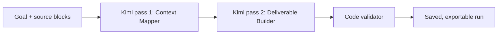

# Kimi Workflow Lab

Most AI demos hide everything between the prompt and the final paragraph. Workflow Lab exposes that middle.

## The user problem

People often paste mixed-quality material into a model: final records, rough notes, draft captions, copied webpages, and sometimes text that contains its own instructions. A fluent answer can make all of those sources look equally trustworthy.

Workflow Lab makes the processing steps inspectable before the output is used.

## Stage 1: Context Mapper

The Worker splits the submitted material into source blocks named `S1`, `S2`, and so on. Kimi receives a strict JSON contract and returns:

- supported and uncertain facts;
- contradictions and their source IDs;
- missing information;
- instructions embedded inside source text;
- a proposed execution plan.

The original source text is explicitly treated as untrusted data, not as instructions.

## Stage 2: Deliverable Builder

The second call receives both the source blocks and the context map. It must build the requested research brief, tutorial, launch plan, or decision memo inside that boundary. Its structured response contains the deliverable, claim-level source IDs, warnings, a reusable workflow recipe, and a bounded confidence value.

Separating mapping from writing makes it possible to inspect what the model believed before its prose made the result sound certain.

## Stage 3: deterministic validation

The last stage is ordinary Worker code. It does not ask another model whether the first two models were correct. It checks five mechanical guarantees:

1. the context map returned structured facts;
2. the deliverable has a title and body;
3. every citation refers to a source ID that actually exists;
4. the response includes a reusable workflow recipe;
5. confidence stays between 0 and 100.

This validator cannot prove that a claim is true. It can stop malformed or invented references from quietly passing through the interface.

## Production boundaries

- The OpenRouter credential is stored as a Cloudflare Worker secret and never sent to the browser.
- Users must sign in before running the workflow.
- Runs are limited to three per account per day and twenty across the public deployment per day.
- Source material is capped at 24,000 characters and 24 source blocks.
- Saved runs belong to the authenticated account and are removed through the existing account-deletion cascade.
- Requests that change data must come from the same origin.

## Reproducible live check

`scripts/lab_smoke.py` creates a disposable account, submits five synthetic source blocks, verifies the result, writes `lab-results/latest.json`, and deletes the account.

The 27 August 2026 live run completed in **27.055 seconds** and passed **5/5 checks**. Kimi identified a conflict between 97 and 143 attendees, rejected a source instruction asking it to invent 10,000 attendees and an award, and cited only valid source IDs.

This is one synthetic test, not a general reliability claim. Its purpose is to make the exact behavior behind the demo inspectable and repeatable.
