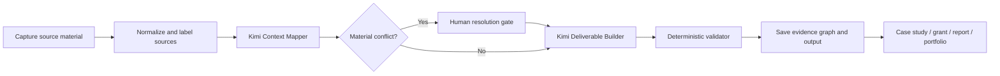
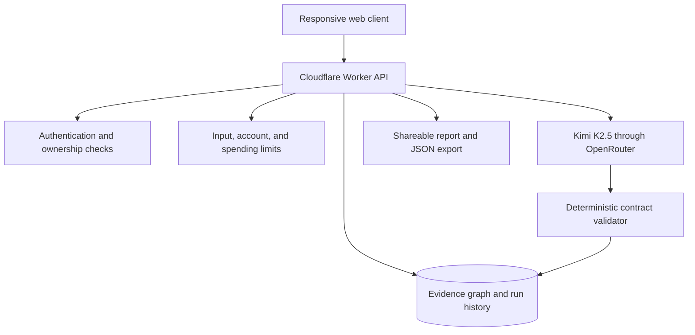

# ProofGraph - Product and System Design

## Product position

ProofGraph is an evidence workspace for people whose work is spread across repositories, reports, spreadsheets, event dashboards, webpages, screenshots, transcripts, and voice notes.

It is not positioned as a universal truth engine. Its job is narrower and more defensible:

1. show what the supplied evidence supports;
2. expose conflicts, uncertainty, missing information, and suspicious instructions;
3. ask a human to resolve material disagreements;
4. produce useful outputs with claim-level source references;
5. validate mechanical guarantees in code before saving or sharing the result.

ProofPack and Kimi Workflow Lab are the working version-zero implementation of this direction.

## Primary users and first use cases

| User | Current problem | First useful output |
| --- | --- | --- |
| Student builder | Work is scattered across GitHub, demos, certificates, and notes | Verifiable portfolio case study |
| NGO or community team | Registration, attendance, photos, surveys, and reports disagree | Partner or donor impact report |
| Founder | Customer calls, research, experiments, and decisions are fragmented | Evidence-backed decision memo |
| Creator or researcher | Sources are numerous and claims are easy to overstate | Cited research brief or article outline |

The initial product wedge is Indian student builders, NGOs, and small community teams. These groups create meaningful work but often lack the time, tools, or language support needed to document it clearly.

## Core workflow

### Stage 1 - Capture and normalization

- Accept repositories, files, webpages, spreadsheets, screenshots, transcripts, and typed notes.
- Assign durable source IDs and store provenance metadata.
- Treat all imported content as untrusted data, never as instructions.
- Preserve the original material so every later claim can be traced back.

### Stage 2 - Kimi Context Mapper

Kimi receives a strict structured-output contract and returns:

- supported and uncertain claims;
- contradictions and the source IDs involved;
- missing information;
- possible prompt-injection attempts;
- a proposed execution plan.

### Stage 3 - Human resolution gate

Material disagreements are shown to the user as focused questions. The product should prefer an explicit answer over silently selecting the most convenient source.

### Stage 4 - Kimi Deliverable Builder

The second model pass works inside the approved evidence boundary. It produces the requested deliverable, claim-level source IDs, warnings, a reusable workflow recipe, and a bounded confidence value.

### Stage 5 - Deterministic validation

Ordinary application code verifies rules that do not need model judgment:

- required fields exist;
- citation IDs refer to supplied sources;
- confidence is within the accepted range;
- the workflow recipe is present;
- the saved record belongs to the authenticated account.

This validator does not prove factual truth. It prevents malformed structure and invented references from passing unnoticed.

## Internal architecture

### Current production boundaries

- The provider credential is stored as a Cloudflare Worker secret and never sent to the browser.
- Users authenticate before running the workflow.
- Per-account and global daily limits control cost and abuse.
- Source material is capped by character and block count.
- State-changing requests must originate from the same application origin.
- Saved runs remain scoped to their account and are removed by the account-deletion cascade.

## Evidence model

Each claim should carry enough information to answer five questions:

| Field | Purpose |
| --- | --- |
| Claim | What the system believes the source supports |
| Source IDs | Which supplied records support or conflict with it |
| Status | Supported, uncertain, contradicted, or user-confirmed |
| Provenance | Source type, owner, date, and retrieval method |
| Decision history | What the model proposed and what the user approved |

The long-term product is a living evidence graph, not a folder of generated paragraphs.

## Measurement plan

### Product-quality measures

- Unsupported claims detected before sharing
- Material conflicts surfaced to the user
- Invalid source IDs blocked by code
- Human corrections captured and reused
- Time from raw evidence to approved output

### Adoption measures

- Users who finish a first evidence pack
- Outputs exported or publicly shared
- Repeat workflows created from the same evidence graph
- Hindi-English workflows completed
- Community-clinic participants who leave with a verifiable public record

## Current proof and limitations

The live Kimi Workflow Lab ran one disposable end-to-end test on 27 August 2026 using five synthetic source blocks. The workflow completed in 27.055 seconds and passed five of five deterministic checks. It surfaced a conflict between 97 and 143 attendees, flagged a source instruction asking it to invent 10,000 attendees and an award, and cited only valid source IDs.

This is a bounded engineering test, not a general reliability claim. The next evaluation step is a permission-safe fixture set that can be rerun after prompt, provider, or model changes.

## Delivery roadmap

### Phase 0 - Working proof

- ProofPack evidence workspace
- Kimi Workflow Lab
- Two model stages plus a code validator
- Authentication, quotas, D1 persistence, saved runs, and JSON export

### Phase 1 - Evidence graph

- Durable source provenance
- Human conflict-resolution questions
- Reusable evidence packs across multiple outputs
- Stronger evaluation fixtures and regression checks

### Phase 2 - Accessible workflows

- Hindi-English input and output
- Mobile capture for screenshots, scans, and voice notes
- Templates for students, NGOs, founders, creators, and community teams
- Permission-safe collaboration and reviewer access

### Phase 3 - Community scale

- Free proof-of-work clinics
- Organization workspaces and approval chains
- Public, verifiable impact records
- Opt-in template and workflow library

## Design principle

> A convincing response is an output. An inspectable process is a product.

